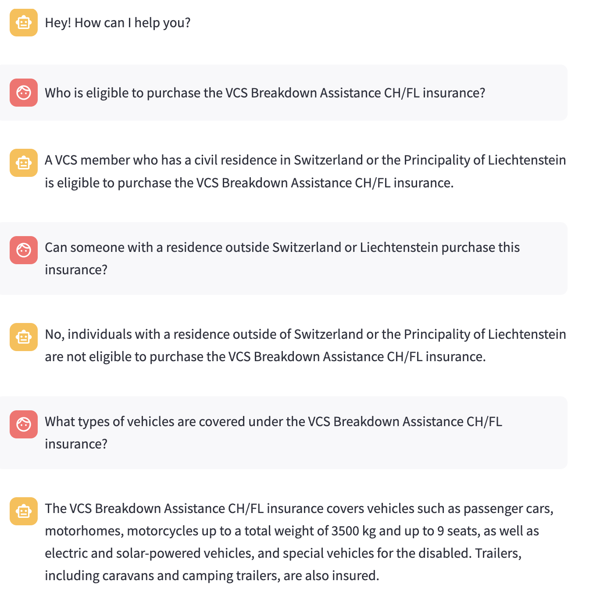

Guideline for the "review"/presentation of the "other project":

## What is the project about? Problem it wants to solve? Goals?

This chatbot will assist employees by providing instant information about various insurance coverages during customer interactions.

particularly in understanding and applying the different insurance coverages.
**Goals**: Enhance Employee Efficiency, Improve Customer Service, Streamline Operations

## Does the project work? Does the code run? Is the output that one expected?

good answer comes out based on the pdf's content. (page 3,4)

ex Q: Who is eligible to purchase the VCS Breadkdown Assistance CH/FL insurance?

## How is the project organised? Building blocks? What does what?

The key file is methods and Support

1. methods.py: processing PDFs, creating vector stores, managing the chatbot's conversational chains, validatig answers, uploading and updating documents on mongodb
2. Support.py: web applications for interacting with the chatbot and a checking system health button.
3. Reporting.py: Generates reports based on user questions and sends emails to highlight areas where training is needed.
4. mongotest.py: A script to test the MongoDB connection.
5. 1_Validierung.py: A page in my app for validating chatbot responses with the help of experienced employees.

## If it not working: Why? Is it a code problem or an approach problem? How to fix it?

- **cannot send the email** Reporting.py:
  smtplib.SMTPAuthenticationError: (535, b'5.7.8 Username and Password not accepted. For more information, go to\n5.7.8 https://support.google.com/mail/?p=BadCredentials ffacd0b85a97d-36075093a34sm3215793f8f.5 - gsmtp')
- I use different email in EMAIL_SENDER
- soultion:
  The email should be activated a the 2-step verification
  and then create an app password

## If It is working: How is the performance? How to improve it (concrete suggestions)?

- As the developer mentioned, everytixme reloading the application, the (pdf's file)vector_store is reloaded and store in the database
- => `get_vector_store` in methods.py:
  - Checking for Existing Vector Store: In get_vector_store, the code checks if the persist_directory exists. If it does, it loads the existing vector store instead of creating a new one.
- `get_systems_health` in methods.py:
  - it would be nice if there was a function that tells which part the chatgpt referred to and answered

---

# environment

    python -m venv .venv
    source .venv/bin/activate

# Example Question

1. **Question:** I have a customer on the phone, he is abroad and has a breakdown. Unfortunately, the car cannot be repaired and has to stay in the garage. The garage is demanding a parking fee of 500 Swiss Francs. Is this covered? He has the VCS protection letter.

2. **Question:** A customer who is insured through ERV has a question regarding the return transport of a previously stolen car. The theft took place 4 months ago abroad. The Spanish police have recovered the vehicle and informed him that he can retrieve the vehicle. Is this transport covered?

3. **Question:** A customer insured through the VCS protection letter has a breakdown abroad. Replacement parts need to be ordered. Is the shipping of the replacement parts covered?

4. **Question:** How long can a VCS customer have a rental car? He has a breakdown in Switzerland and his car can only be repaired in a week.
